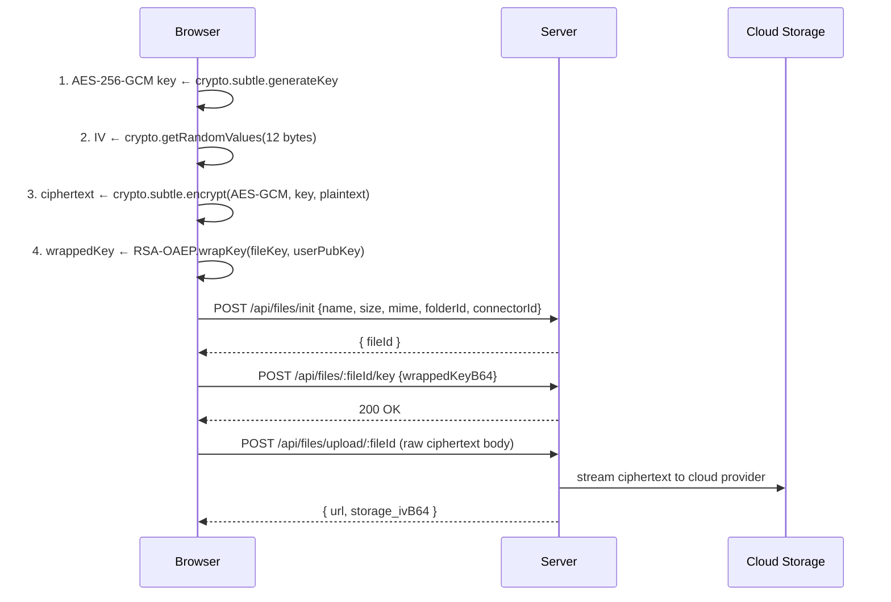
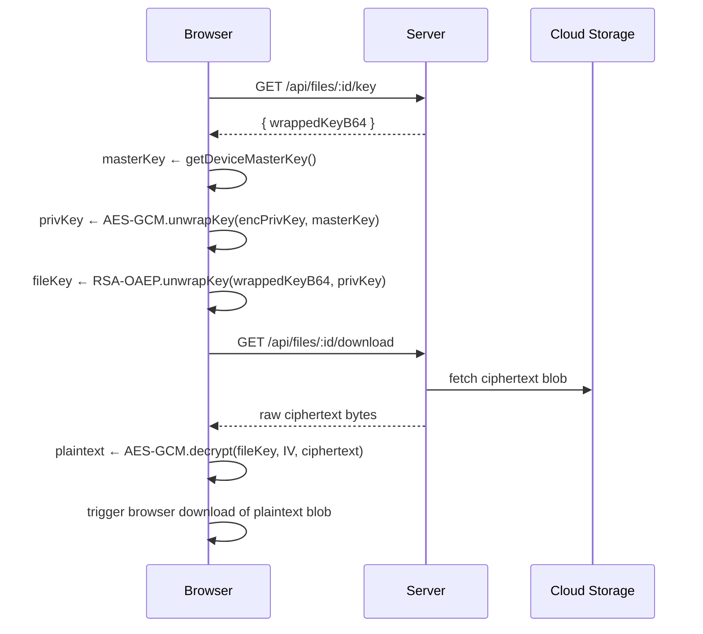
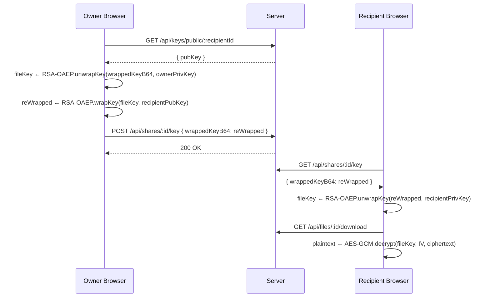

# Algorithms & Cryptographic Flows

All cryptographic operations that touch plaintext file content occur exclusively in the browser using the Web Cryptography API (`crypto.subtle`). The server handles only ciphertext, wrapped keys, and metadata.

---

## Device Master Key

The device master key is the root of the client-side key hierarchy. It is generated once per device on first login and stored only in `localStorage` — it is never transmitted to the server.

```ts title="frontend/src/crypto/zk.ts"
const STORAGE_KEY = "DEVICE_MASTER_KEY_V1";

export async function getDeviceMasterKey(): Promise<CryptoKey> {
  const stored = localStorage.getItem(STORAGE_KEY);
  if (stored) {
    const raw = Uint8Array.from(atob(stored), c => c.charCodeAt(0));
    return crypto.subtle.importKey("raw", raw, { name: "AES-GCM" }, false, ["wrapKey", "unwrapKey"]);
  }
  // First use — generate and persist
  const key = await crypto.subtle.generateKey({ name: "AES-GCM", length: 256 }, true, ["wrapKey", "unwrapKey"]);
  const exported = await crypto.subtle.exportKey("raw", key);
  localStorage.setItem(STORAGE_KEY, btoa(String.fromCharCode(...new Uint8Array(exported))));
  return key;
}
```

**Security implication:** Clearing `localStorage` (private browsing, browser wipe) permanently destroys access to all previously uploaded files, because the encrypted private key blob stored on the server can no longer be unwrapped.

---

## RSA Key Pair Initialisation

On first login the browser generates an RSA-4096 key pair. The private key is immediately wrapped with the device master key before the blob is sent to the server.

```
┌─────────────────────────────────────────────────────┐
│  1. generateKey(RSA-OAEP SHA-256, 4096-bit)         │
│  2. exportKey("pkcs8", privateKey)  → raw bytes      │
│  3. wrapKey("raw", privateKey, masterKey, AES-GCM)  │
│     → IV[12] || wrappedPrivKey bytes                │
│  4. POST /api/keys { pubKey, encPrivKey: base64 }    │
│  5. Server stores encPrivKey — cannot decrypt it     │
└─────────────────────────────────────────────────────┘
```

---

## Three-Phase File Upload



### Ciphertext Format

```
Blob stored on cloud provider:
┌────────────┬──────────────────────────────────┐
│  IV[12]    │  AES-256-GCM ciphertext + AuthTag │
└────────────┴──────────────────────────────────┘
```

The 12-byte IV is also stored in `File.storage_ivB64` in MongoDB so the download path can reconstruct the same format.

---

## File Download & Decryption



---

## Zero-Knowledge File Sharing (Key Re-wrap)

The owner's browser re-wraps the plaintext file key using the recipient's RSA public key. The server stores only the re-wrapped blob — it cannot derive the plaintext key at any point.



---

## Server-Side Secret Encryption

OAuth tokens and TOTP secrets are encrypted at rest using `backend/services/crypto.js`. This is a symmetric AES-256-GCM operation using the server-held `TOTP_ENC_KEY`.

```js title="backend/services/crypto.js"
export function sealSecret(plaintext) {
  const iv = crypto.randomBytes(12);
  const cipher = crypto.createCipheriv("aes-256-gcm", KEY_BYTES, iv);
  const ct = Buffer.concat([cipher.update(plaintext, "utf8"), cipher.final()]);
  const tag = cipher.getAuthTag(); // 16 bytes
  return Buffer.concat([iv, tag, ct]).toString("base64");
  // Format: Base64( IV[12] || AuthTag[16] || Ciphertext )
}

export function openSecret(b64) {
  const buf = Buffer.from(b64, "base64");
  const iv  = buf.subarray(0, 12);
  const tag = buf.subarray(12, 28);
  const ct  = buf.subarray(28);
  const decipher = crypto.createDecipheriv("aes-256-gcm", KEY_BYTES, iv);
  decipher.setAuthTag(tag);
  return Buffer.concat([decipher.update(ct), decipher.final()]).toString("utf8");
}
```

---

## Audit Log Hash Chain

Every audit log entry is cryptographically linked to the previous entry using SHA-256. This makes undetected retrospective insertion or modification of log records computationally infeasible.

```js title="backend/services/hashChain.js"
function canonical(record) {
  return JSON.stringify({
    actorId:   record.actorId?.toString(),
    action:    record.action,
    targetId:  record.targetId?.toString(),
    targetType: record.targetType,
    timestamp: record.timestamp?.toISOString(),
    prevHash:  record.prevHash,
  });
}

function computeHash(prevHash, record) {
  return crypto
    .createHash("sha256")
    .update(prevHash + canonical({ ...record, prevHash }))
    .digest("hex");
}
```

**Chain verification:** To verify log integrity, recompute each hash from the genesis entry (prevHash = `"0"`) and confirm each stored `hash` matches the recomputation. Any mismatch indicates tampering.

---

## Algorithm Selection Rationale

| Algorithm | Choice | Rationale |
|-----------|--------|-----------|
| Symmetric encryption | AES-256-GCM | NIST-approved; authenticated (detects tampering); hardware-accelerated via Web Crypto |
| Asymmetric encryption | RSA-4096 OAEP | Wide browser support via `crypto.subtle`; OAEP padding is IND-CCA2 secure |
| Key derivation | None (random key per file) | Avoids KDF weaknesses; each file has an independent random key |
| Password hashing | bcrypt (12 rounds) | Memory-hard; industry standard; 12 rounds ≈ 250ms on current hardware |
| Token signing | HMAC-SHA256 (JWT) | Standard; `jsonwebtoken` library; separate secrets for access and refresh |
| Audit integrity | SHA-256 hash chain | Simple, auditable, deterministic |
| TOTP | RFC 6238 (TOTP) | Standard interoperability with Google Authenticator, Authy, etc. |
