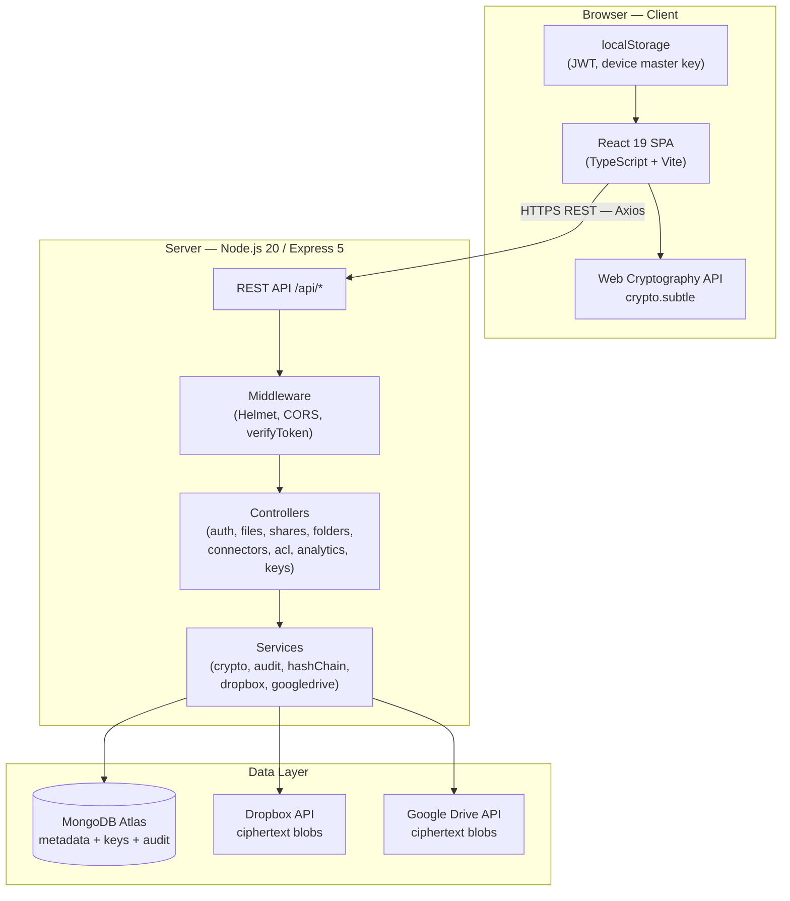
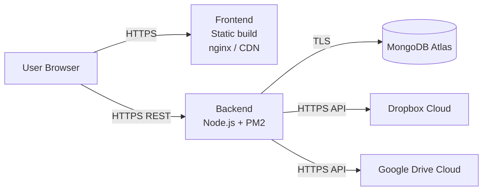

# Architecture

## System Architecture



---

## Deployment Architecture



---

## Information Architecture

```
Cipher Cloud
├── Authentication Layer
│   ├── Email/Password (bcrypt + JWT)
│   ├── Google OAuth (ID token verification)
│   └── TOTP 2FA (otplib, encrypted secret)
│
├── Cryptographic Layer (Zero-Knowledge)
│   ├── Per-user RSA-4096 key pair
│   │   ├── Public key  → stored plaintext on server
│   │   └── Private key → AES-GCM encrypted by client; blob stored on server
│   ├── Per-file AES-256-GCM key
│   │   ├── Generated client-side at upload
│   │   └── Wrapped with owner RSA public key → FileKey (server)
│   └── Per-share key re-wrap
│       └── File AES key wrapped with recipient RSA public key → SharedFileKey (server)
│
├── Storage Layer
│   ├── MongoDB  (metadata: file records, users, shares, audit logs)
│   └── Cloud Providers  (ciphertext blobs)
│       ├── Dropbox (via OAuth connector)
│       └── Google Drive (via OAuth connector)
│
└── API Layer (Express 5, REST)
    ├── /api/auth         — Authentication & OAuth
    ├── /api/auth/totp    — 2FA management
    ├── /api/user         — Profile management
    ├── /api/keys         — RSA key management
    ├── /api/files        — File CRUD + upload/download
    ├── /api/folders      — Virtual folder organisation
    ├── /api/shares       — ZK file sharing
    ├── /api/acl          — Access control lists
    ├── /api/analytics    — Usage statistics
    ├── /api/connectors   — Cloud storage OAuth connectors
    └── /api/settings     — OAuth settings
```
