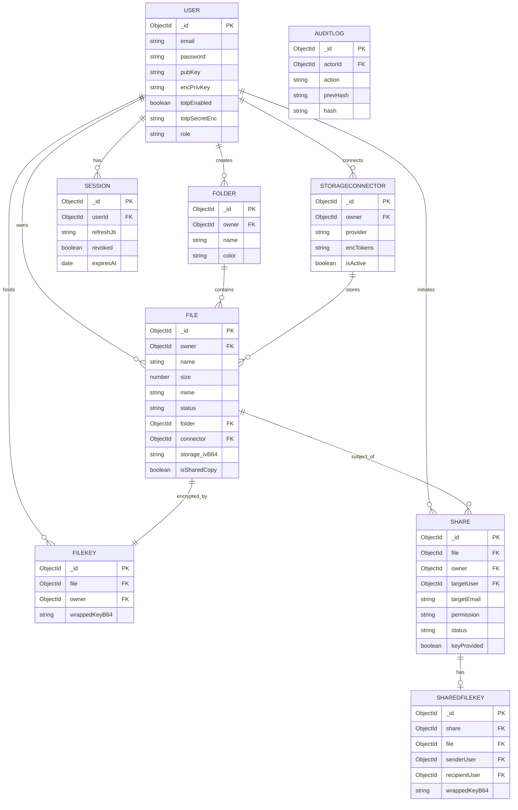

# Database & Data Model

## Entity Relationship Diagram

## Design Principles

| Principle | Implementation |
|-----------|---------------|
| Content separate from metadata | `files` collection stores only metadata — no file content |
| Keys separate from data | `filekeys` and `sharedfilekeys` are separate collections; access checked independently |
| Encrypted sensitive fields | `encPrivKey`, `totpSecretEnc`, `encTokens` are all stored as AES-GCM ciphertext blobs |
| Audit integrity | `auditlogs` uses a hash chain — each entry's hash includes `prevHash` |
| Unique compound indexes | `{ owner, name }` on Folder; `{ file, owner }` on FileKey; `{ share, recipientUser }` on SharedFileKey |

## Collection Summary

| Collection | Records stored | Sensitive fields encrypted |
|------------|---------------|--------------------------|
| `users` | Profile data, public key, encrypted private key, encrypted TOTP secret | `encPrivKey`, `totpSecretEnc` |
| `files` | Filename, size, MIME type, IV, status, folder, connector reference | None (no content) |
| `filekeys` | RSA-wrapped AES file keys (owner) | Not readable by server |
| `folders` | Name, colour, owner | None |
| `shares` | Share status, permission, target user/email | None |
| `sharedfilekeys` | RSA-wrapped AES file keys (recipient) | Not readable by server |
| `storageconnectors` | Provider, display name, encrypted OAuth tokens | `encTokens` |
| `sessions` | Refresh token JTI, revocation flag, expiry | None |
| `auditlogs` | Action type, actor, target, SHA-256 hash chain | None |
| `appsettings` | OAuth credentials (Google Client ID etc.) | Should be guarded by admin role |
