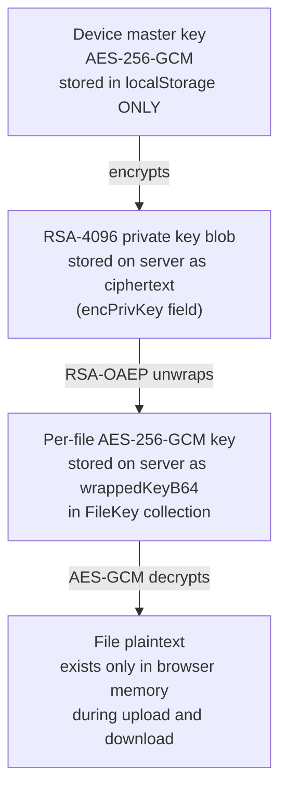

# Security & Privacy Design

## Zero-Knowledge Architecture

The server is cryptographically prevented from reading user file content. This is enforced through the key hierarchy:



At no point does the server hold a key in a form that allows it to decrypt file content.

---

## Defence-in-Depth Layers

| Layer | Implementation |
|-------|---------------|
| **Transport** | HTTPS in production; `Secure` + `HttpOnly` cookie flags |
| **HTTP Headers** | Helmet.js: CSP, HSTS, X-Frame-Options, X-Content-Type-Options, Referrer-Policy |
| **Authentication** | 55-minute JWT access tokens; 7-day refresh tokens in HttpOnly cookies |
| **Authorisation** | `verifyToken` on all protected routes; resource ownership checks in every controller |
| **Zero-Knowledge** | Server stores only ciphertext + wrapped key blobs; no code path to unwrap |
| **Credential Encryption** | OAuth tokens + TOTP secrets encrypted with AES-256-GCM at rest |
| **Input Validation** | JSON body: 1 MB cap; file upload: 500 MB cap |
| **Audit Trail** | Append-only SHA-256 hash-chained log |

---

## Authentication Security

| Mechanism | Detail |
|-----------|--------|
| Password hashing | bcryptjs, 12 salt rounds |
| Access token | JWT, 55 min TTL, `JWT_ACCESS_SECRET` |
| Refresh token | JWT, 7-day TTL, HttpOnly + Secure cookie, `JWT_REFRESH_SECRET` |
| Session revocation | `Session.revoked` flag + `refreshJti` uniqueness |
| Google OAuth | Server-side ID token verification via `google-auth-library` |
| TOTP secret storage | AES-256-GCM encrypted using `TOTP_ENC_KEY` |

---

## OWASP Top 10 Coverage

| Risk | Mitigation |
|------|-----------|
| A01 Broken Access Control | `verifyToken` middleware + ownership checks in all controllers |
| A02 Cryptographic Failures | AES-256-GCM (files), RSA-4096 OAEP (keys), SHA-256 (audit); no weak algorithms |
| A03 Injection | Mongoose parameterised queries; no raw query string construction |
| A05 Security Misconfiguration | Helmet.js; CORS restricted to known origins; `COOKIE_SECURE=true` in production |
| A07 Auth Failures | Short-lived JWTs; refresh rotation; bcrypt 12 rounds; TOTP 2FA |
| A09 Logging & Monitoring | Hash-chained audit log; Morgan HTTP request logging |

---

## OAuth Token Security

OAuth tokens for Dropbox and Google Drive are AES-256-GCM encrypted before storage using the server-side `TOTP_ENC_KEY`. The format stored in `StorageConnector.encTokens` is:

```
Base64( IV[12] || GCM Auth Tag[16] || Ciphertext )
```

The GCM authentication tag detects any tampering with the stored token blob.

---

## Known Security Gaps (Pre-Production)

:::warning Action required before production
These gaps must be addressed before deploying to production.
:::

| Gap | Risk | Fix |
|-----|------|-----|
| No admin guard on `GET/PUT /api/settings/oauth` | Any user can read/modify OAuth credentials | Add `verifyAdmin` middleware |
| No rate limiting on `/api/auth/login` | Brute-force password attacks | Add `express-rate-limit` |
| No MongoDB TTL index on sessions | Old session records accumulate | `db.sessions.createIndex({ expiresAt: 1 }, { expireAfterSeconds: 0 })` |
