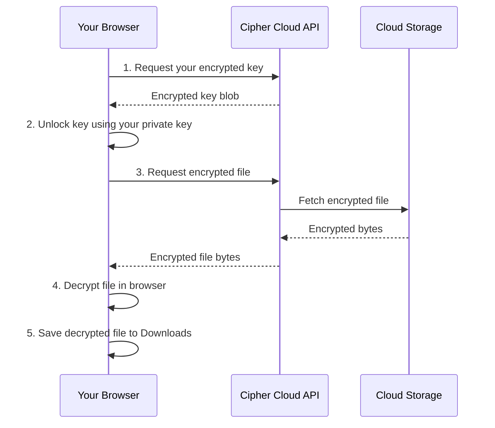

# Downloading Files

Cipher Cloud decrypts files on your device during download. The unencrypted file is saved directly to your Downloads folder and never transmitted in readable form.

---

## How Download Works

---

## Downloading from the Explorer

You have three ways to download a file:

**Double-click:** Double-click any file icon in the file grid.

**Hover button:** Hover over a file — a download button appears in the top right of the file card. Click it.

**Right-click menu:** Right-click the file and select **Download**.

---

## Downloading a Shared File

Files shared with you appear in the **Shared** section. Downloading a shared file works the same way Cipher Cloud uses the recipient-specific encrypted key that was set up when the file was shared with you.

1. Click **Shared** in the left sidebar.
2. Find the file in the shared files list.
3. Click **Download**.

---

## Troubleshooting Downloads

| Problem | Likely Cause | Solution |
|---------|-------------|---------|
| "Download failed" error | No encryption key found | Try from the same browser where you originally uploaded the file |
| File opens but is corrupted | Download interrupted mid-transfer | Try again on a stable connection |
| File won't open after saving | Wrong file association on your OS | Right-click the downloaded file and choose "Open With" to select the correct app |
| Shared file won't download | Key not yet provided by the owner | Ask the file owner to complete the sharing process |
