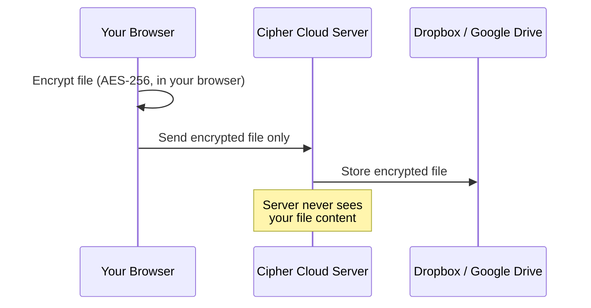

# Cipher Cloud — User Manual

**Version:** 1.0 | **Date:** 27 May 2026 | **Audience:** End Users

Cipher Cloud is a private, encrypted cloud file storage service. Unlike standard cloud storage services such as Dropbox or Google Drive, Cipher Cloud encrypts your files **inside your web browser** before they are sent anywhere. This means that even Cipher Cloud itself — and your cloud storage provider — cannot read the contents of your files.

Your files are kept private at all times. When you download a file, Cipher Cloud fetches the encrypted version and decrypts it on your device. The unencrypted file never travels over the internet.

---

## Quick-Start Guide

Get up and running in five steps:

1. **Create an account** at the Cipher Cloud sign-up page.
2. **Connect your Dropbox or Google Drive** account from the Connectors page.
3. **Go to the File Explorer** and click the **Upload** button.
4. **Select a file** — Cipher Cloud encrypts and uploads it automatically.
5. **Download the file** by double-clicking it — Cipher Cloud decrypts it and saves it to your device.

---

## Intended Users

- Individuals who want to keep personal documents private in the cloud
- Small teams who share sensitive files with colleagues
- Anyone who uses Dropbox or Google Drive and wants an extra layer of security

You do not need any technical knowledge to use Cipher Cloud. However, you will need a Dropbox account or a Google account to use as your storage backend before you can upload files.

---

## How Privacy Works

The encryption key never leaves your browser in a form the server can read. Cipher Cloud stores only the locked version of your files.

---

## In This Manual

| Section | What you will learn |
|---------|-------------------|
| [Prerequisites](/user-manual/prerequisites) | What you need before you start |
| [Account Setup](/user-manual/account-setup) | Creating an account and signing in |
| [Two-Factor Auth](/user-manual/two-factor-auth) | Adding an extra layer of login security |
| [Cloud Storage](/user-manual/cloud-storage) | Connecting Dropbox or Google Drive |
| [Uploading Files](/user-manual/uploading-files) | Encrypting and uploading your files |
| [Downloading Files](/user-manual/downloading-files) | Downloading and decrypting your files |
| [Folders & Explorer](/user-manual/folders-and-explorer) | Organising your files |
| [Sharing Files](/user-manual/sharing-files) | Securely sharing with other users |
| [Analytics](/user-manual/analytics) | Viewing your usage statistics |
| [Profile](/user-manual/profile) | Managing your account |
| [Troubleshooting](/user-manual/troubleshooting) | Fixing common issues |
