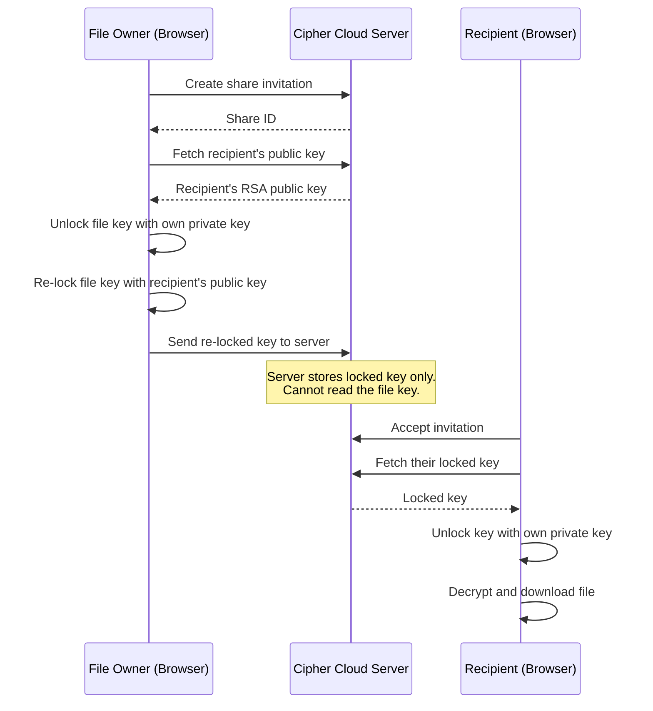

# Sharing Files

Cipher Cloud allows you to share encrypted files with other Cipher Cloud users. The recipient can download and decrypt the file using their own account without Cipher Cloud ever seeing the encryption key.

---

## How Zero-Knowledge Sharing Works

Standard file sharing sends the file key to the server, which then forwards it to the recipient. This breaks privacy.

Cipher Cloud does it differently:

The server stores a version of the file key that only the recipient can unlock. No one else including Cipher Cloud can read it.

---

## Sharing a File

1. In the **Explorer**, right click the file you want to share.
2. Select **Share**.
3. In the Share dialog:
   - Enter the **email address** of the person you want to share with.
   - Choose the **permission level:**
     - **Viewer** can download and read the file
     - **Editor** has additional editor access
   - Optionally add a **note** or message.
4. Click **Share**.

Cipher Cloud will:
- Create the share invitation
- Automatically re-lock the file's encryption key for the recipient
- Place the invitation in the recipient's inbox

:::info Recipient must have a Cipher Cloud account
The sharing process requires the recipient to have a Cipher Cloud account, because it uses their personal encryption key. Ask them to register first if they don't have an account.
:::

---

## Revoking a Share

To remove someone's access:

1. Right-click the file then select **Share** to open the Share dialog.
2. Find the recipient in the list of existing shares.
3. Click **Revoke**.

The recipient loses access immediately. They cannot download the file again after revocation.

---

## Permission Levels

| Permission | Can Download | Can Edit Metadata |
|------------|-------------|------------------|
| Viewer | Yes | No |
| Editor | Yes | Yes |
