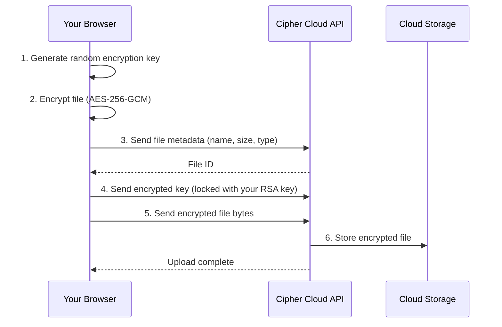

# Uploading Files

Cipher Cloud encrypts every file in your browser before uploading it. The server never receives your file in readable form.

:::info Before you upload
You must have at least one cloud storage account connected. See [Connecting Cloud Storage](./cloud-storage).
:::

---

## What Happens When You Upload

Your original file never leaves your browser in readable form.

---

## Uploading from the Explorer

1. Click **Explorer** in the left sidebar.
2. Click the **Upload** button (top-right of the file panel).
3. A file picker opens. Select one or more files.
4. Cipher Cloud encrypts and uploads each file automatically.
5. When complete, the file appears in the file grid.

:::tip Upload to a specific folder
Click a folder in the left panel before uploading. Files will be automatically placed in that folder.
:::

---

## Uploading via Right-Click

1. On the Explorer page, **right-click** on an empty area of the file panel.
2. Select **Upload File** from the context menu.
3. Select your file(s) and proceed as above.

---

## File Size Limit

The maximum file size is **500 MB per file**. Attempting to upload a larger file will show an error message.

| File type | Supported? |
|-----------|-----------|
| Documents (PDF, Word, Excel) | ✓ Yes |
| Images (JPG, PNG, GIF, HEIC) | ✓ Yes |
| Videos (MP4, MOV, AVI) | ✓ Yes (up to 500 MB) |
| Archives (ZIP, RAR, 7z) | ✓ Yes |
| All other types | ✓ Yes — all file types are supported |

---

## Uploading Multiple Files

You can select multiple files in the file picker at once. Cipher Cloud processes them one by one. A loading indicator is shown while uploading is in progress. Do not close the browser tab during upload.
